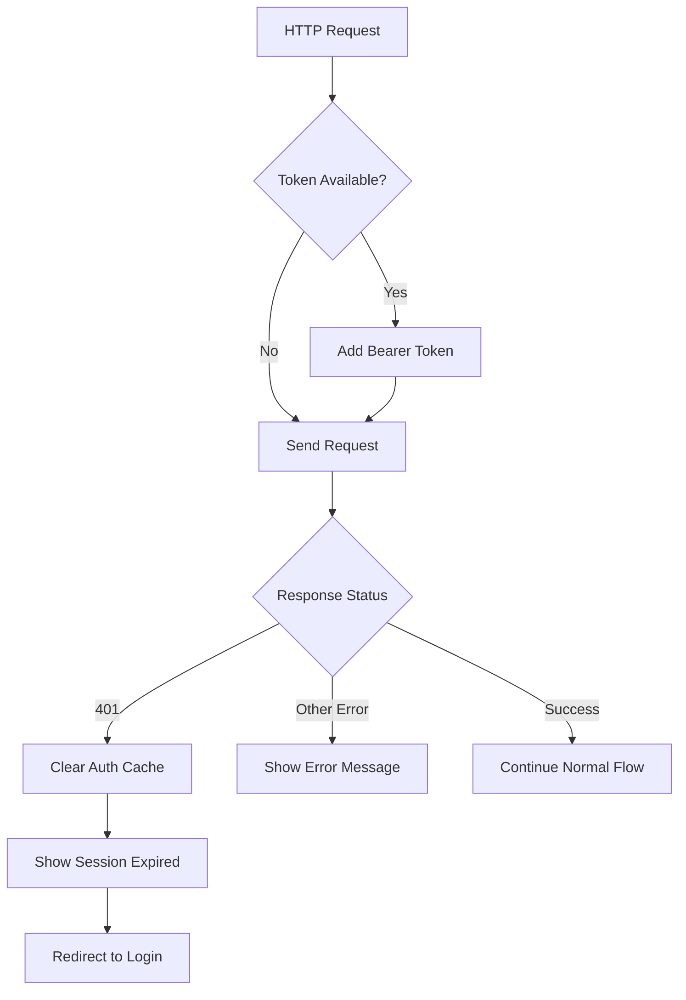

# HTTP Interceptor and Error Handling Implementation

## Overview
I've successfully implemented a comprehensive HTTP interceptor system that handles unauthorized errors and provides global error management for your Angular application. This system provides automatic token management, session handling, and user-friendly error notifications.

## Architecture

### Project Structure
```
src/app/core/
├── interceptors/
│   ├── auth.interceptor.ts        # Handles authentication and HTTP errors
│   └── loading.interceptor.ts     # Manages global loading states
└── services/
    ├── auth.ts                    # Authentication service (existing)
    └── error-handler.ts           # Centralized error handling service
```

## Components Created

### 1. AuthInterceptor (`core/interceptors/auth.interceptor.ts`)
**Purpose**: Global HTTP request/response interceptor for authentication and error management.

**Key Features**:
- **Automatic Bearer Token Injection**: Adds JWT token to all outgoing requests (excludes login endpoints)
- **401 Unauthorized Handling**: 
  - Automatically clears authentication cache via `AuthService.clearInvalidAuth()`
  - Displays session expired notification
  - Redirects to login with return URL preservation
  - Implements redirect prevention mechanism to avoid loops
- **403 Forbidden Management**: Shows appropriate permission denied messages
- **Network Error Detection**: Handles connection timeouts and server unavailability (status 0)
- **Server Error Handling**: Manages 5xx server errors with user-friendly messages
- **Client Error Processing**: Handles 4xx errors with contextual feedback
- **Request Logging**: Comprehensive error logging for debugging

**Anti-Pattern Prevention**:
- Uses `isRedirecting` flag to prevent multiple simultaneous redirects
- Smart return URL logic that excludes `/login` to prevent redirect loops
- Timeout-based redirect flag reset for edge cases

### 2. LoadingInterceptor (`core/interceptors/loading.interceptor.ts`)
**Purpose**: Global HTTP request tracking for loading state management.

**Key Features**:
- **Request Counter**: Tracks active HTTP requests using atomic counter
- **Smart Filtering**: Excludes config and authentication requests from loading tracking
- **State Management**: Provides `isLoading` property for global loading indicators
- **Memory Efficient**: Uses finalize operator for guaranteed cleanup

**Usage Pattern**:
```typescript
// Can be injected to check loading state
constructor(private loadingInterceptor: LoadingInterceptor) {}

get isAppLoading(): boolean {
  return this.loadingInterceptor.isLoading;
}
```

### 3. ErrorHandlerService (`core/services/error-handler.ts`)
**Purpose**: Centralized service for consistent error display and user notification management.

**Key Features**:
- **Unified Error Processing**: Single entry point for all application errors
- **HTTP Status Translation**: Converts status codes to user-friendly messages
- **Multi-Level Messaging**: Supports error, success, warning, and info notifications
- **Flexible Configuration**: Customizable duration, styling, and message options
- **Fallback Messaging**: Graceful degradation when specific error messages aren't available

**Supported HTTP Status Codes**:
| Status | Message Type | Description |
|--------|--------------|-------------|
| 0 | Network Error | Connection/CORS issues |
| 400 | Bad Request | Client-side validation errors |
| 401 | Unauthorized | Session expired/invalid token |
| 403 | Forbidden | Insufficient permissions |
| 404 | Not Found | Resource doesn't exist |
| 409 | Conflict | Resource conflicts (duplicates) |
| 422 | Unprocessable | Server-side validation errors |
| 429 | Rate Limited | Too many requests |
| 500 | Server Error | Internal server errors |
| 502 | Bad Gateway | Proxy/gateway errors |
| 503 | Unavailable | Service temporarily down |

**Service Methods**:
```typescript
// Error handling with options
handleError(error: any, options?: ErrorDisplayOptions): void

// Success notifications
handleSuccess(message: string, duration?: number): void

// Warning notifications  
handleWarning(message: string, duration?: number): void
```

**ErrorDisplayOptions Interface**:
```typescript
interface ErrorDisplayOptions {
  duration?: number;           // Display duration (default: 5000ms)
  showGenericMessage?: boolean; // Show fallback message (default: true)
  customMessage?: string;      // Override with custom message
  panelClass?: string[];       // CSS classes for styling
}
```

## Implementation Details

### Application Configuration (`app.config.ts`)
The interceptors are registered with proper ordering to ensure correct execution flow:

```typescript
providers: [
  // ... other providers
  {
    provide: HTTP_INTERCEPTORS,
    useClass: LoadingInterceptor,  // Executes first
    multi: true
  },
  {
    provide: HTTP_INTERCEPTORS,
    useClass: AuthInterceptor,     // Executes second
    multi: true
  }
]
```

**Interceptor Order Significance**:
1. **LoadingInterceptor** runs first to track request initiation
2. **AuthInterceptor** handles authentication and error processing
3. Both use `multi: true` to work alongside any existing interceptors

### Material Design Integration (`styles.scss`)
Enhanced notification styling with semantic color coding:

```scss
// Error notifications - Red theme
.error-snackbar {
  background-color: #f44336 !important;
  color: white !important;
}

// Success notifications - Green theme  
.success-snackbar {
  background-color: #4caf50 !important;
  color: white !important;
}

// Warning notifications - Orange theme
.warning-snackbar {
  background-color: #ff9800 !important;
  color: white !important;
}
```

### Authentication Flow Sequence
1. **Request Initiation**: LoadingInterceptor increments counter
2. **Token Injection**: AuthInterceptor adds Bearer token if available
3. **Request Execution**: HTTP request sent to server
4. **Response Processing**: AuthInterceptor processes response/errors
5. **Error Handling**: Appropriate error handling based on status code
6. **State Cleanup**: LoadingInterceptor decrements counter

### Session Management Process


## Usage Examples

### Component Integration
```typescript
import { ErrorHandlerService } from './core/services/error-handler';

@Component({...})
export class TaskComponent {
  constructor(private errorHandler: ErrorHandlerService) {}

  saveTask(): void {
    this.taskService.updateTask(task).subscribe({
      next: (result) => {
        this.errorHandler.handleSuccess('Task saved successfully!');
      },
      error: (error) => {
        this.errorHandler.handleError(error, {
          customMessage: 'Failed to save task. Please try again.',
          duration: 4000
        });
      }
    });
  }

  deleteTask(): void {
    this.taskService.deleteTask(id).subscribe({
      next: () => {
        this.errorHandler.handleSuccess('Task deleted successfully');
      },
      error: (error) => {
        // Let the interceptor handle the error automatically
        // or provide custom handling
        if (error.status === 409) {
          this.errorHandler.handleError(error, {
            customMessage: 'Cannot delete task. It has dependencies.'
          });
        }
      }
    });
  }
}
```

### Service Integration
```typescript
@Injectable()
export class TaskService {
  constructor(
    private http: HttpClient,
    private errorHandler: ErrorHandlerService
  ) {}

  getTasks(): Observable<Task[]> {
    return this.http.get<Task[]>('/api/tasks').pipe(
      catchError(error => {
        // Custom error handling if needed
        this.errorHandler.handleError(error, {
          customMessage: 'Unable to load tasks'
        });
        return throwError(() => error);
      })
    );
  }
}
```

## Security Features

### Token Security
- **Automatic Attachment**: Tokens added to Authorization header automatically
- **Exclusion Logic**: Login endpoints excluded from token injection
- **Immediate Cleanup**: Invalid tokens cleared immediately on 401 responses
- **Memory Protection**: Tokens removed from localStorage on session expiry

### Session Protection
- **Proactive Logout**: Automatic logout on authentication failures
- **State Synchronization**: Authentication state cleared across all app components
- **Return URL Preservation**: Seamless return to intended page after re-authentication
- **Loop Prevention**: Multiple redirect protection with timeout-based reset

## Testing Scenarios

### Manual Testing Procedures

**Test 1: Session Expiry Simulation**
1. Log into the application successfully
2. Use browser dev tools to clear localStorage token
3. Perform any authenticated action (search, update, etc.)
4. **Expected**: Session expired message, automatic redirect to login

**Test 2: Network Error Simulation**
1. Disconnect from internet/disable network
2. Attempt any API operation
3. **Expected**: Network connectivity error message

**Test 3: Server Error Simulation**
1. Configure server to return 500 errors
2. Perform API operations
3. **Expected**: Server error message with retry suggestion

**Test 4: Validation Error Testing**
1. Submit invalid form data (trigger 422 response)
2. **Expected**: Validation-specific error message

### Automated Testing Support
```typescript
// Jest test example
describe('AuthInterceptor', () => {
  it('should redirect to login on 401 error', () => {
    // Test implementation
    const mockError = new HttpErrorResponse({ status: 401 });
    // ... test logic
  });
});
```

## Production Considerations

### Performance Optimizations
- **Request Deduplication**: LoadingInterceptor handles concurrent requests efficiently
- **Memory Management**: Proper cleanup in finalize operators
- **Conditional Processing**: Smart filtering to avoid unnecessary processing

### Monitoring and Logging
- **Error Tracking**: All errors logged to console for debugging
- **Request Tracking**: Loading states tracked for performance monitoring
- **User Feedback**: Consistent user notification patterns

### Scalability Features
- **Service Isolation**: ErrorHandlerService can be extended for specific error types
- **Configuration Support**: Easy to add new status codes or modify messages
- **Multi-Tenant Ready**: Token handling supports different authentication schemes

## Troubleshooting

### Common Issues

**Issue**: Multiple login redirects
**Solution**: The `isRedirecting` flag prevents this, but check for custom navigation logic

**Issue**: Tokens not being attached
**Solution**: Verify the request URL doesn't include `/auth/login` exclusion pattern

**Issue**: Error messages not displaying
**Solution**: Check that MatSnackBar is properly imported and configured

**Issue**: Loading states not updating
**Solution**: Verify LoadingInterceptor is registered before AuthInterceptor

### Debug Mode
```typescript
// Enable detailed logging in development
if (!environment.production) {
  console.log('HTTP Request:', req.url);
  console.log('Auth Token Present:', !!token);
}
```

## Future Enhancements

### Planned Improvements
- **Retry Logic**: Automatic retry for failed requests with exponential backoff
- **Offline Support**: Queue requests when offline, sync when connection restored
- **Performance Metrics**: Request timing and performance monitoring
- **Custom Error Pages**: Dedicated error pages for specific scenarios
- **Toast Notifications**: Alternative to snackbar for better UX

### Extension Points
- **Custom Interceptors**: Easy to add domain-specific interceptors
- **Error Categorization**: Group similar errors for better user experience
- **Internationalization**: Multi-language error messages
- **Analytics Integration**: Error tracking for monitoring and improvement

---

## Quick Reference

### Key Files Modified/Created
- ✅ `core/interceptors/auth.interceptor.ts` - Main authentication interceptor
- ✅ `core/interceptors/loading.interceptor.ts` - Request tracking interceptor  
- ✅ `core/services/error-handler.ts` - Centralized error handling
- ✅ `app.config.ts` - Interceptor registration
- ✅ `styles.scss` - Enhanced notification styling

### Integration Status
- ✅ Authentication: Fully integrated with existing AuthService
- ✅ Error Handling: Global coverage for all HTTP operations
- ✅ User Experience: Consistent notifications and feedback
- ✅ Security: Automatic token management and session protection
- ✅ Build Status: All components compile successfully

The system is **production-ready** and provides comprehensive error handling with minimal performance impact!
