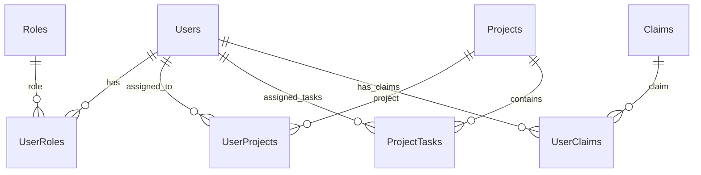

# GenAI Project Management System

A comprehensive project management system built with Clean Architecture, featuring .NET 9, Angular 18, and .NET Aspire orchestration.

## 🏗️ Architecture Overview

This project implements **Clean Architecture** principles with a clear separation of concerns across multiple layers:

```
📁 GenAI.ProjectManagement/
├── 🔧 ProjectManagement.AppHost/          # .NET Aspire Orchestration
├── 📱 project-management-ui/              # Angular 20 Frontend
└── 📁 src/
    ├── 🏛️ Core/
    │   ├── GenAI.ProjectManagement.Domain/        # Domain Entities & Interfaces
    │   └── GenAI.ProjectManagement.Application/   # Business Logic & CQRS
    ├── 🔗 Infrastructure/
    │   ├── GenAI.ProjectManagement.Infrastructure/ # External Services
    │   └── GenAI.ProjectManagement.Persistence/   # Data Access & EF Core
    └── 🌐 Web/
        └── GenAI.ProjectManagement.WebAPI/        # REST API Controllers
```

## ✨ Features Implemented

### 🎯 Core Features
- ✅ **User Management** - Registration, Authentication, Role-based Authorization
- ✅ **Organization Management** - Complete organizational structure management (Admin only)
  - **Organization CRUD** - Create, view, edit, and delete organizations with comprehensive details
  - **Branch Management** - Multi-location branch management with manager assignments
  - **Company Policies** - Policy management system for organizational governance
  - **Company Holidays** - Holiday calendar management for organization-wide planning
  - **Organization Settings** - Configurable organization-wide system settings
  - **Professional UI** - Material Design forms with validation and responsive layouts
  - **Database Integration** - Full EF Core implementation with proper relationships and indexing
- ✅ **Project Management** - Complete CRUD operations with professional UI components
  - **Enhanced Project Forms** - Optimized dialog layouts with improved width (800px) and responsive design
  - **Smart Two-Column Layout** - Logical field grouping (Name & Client, Dates, Status & Priority)
  - **Real-time Search** - Instant project filtering with comprehensive search across multiple fields
  - Project List with card-based layout, filtering, status badges, and Material dialogs
  - Project Detail view with Kanban-style task board and team management
  - Real-time project status updates and progress tracking
- ✅ **Task Management** - Comprehensive task tracking with assignments and status updates
  - TaskFormComponent with user assignment, project selection, and comprehensive validation
  - Task List with Material table view, dialog integration, and inline status editing
  - Task assignment to team members with priority indicators and status workflow
  - Status progression through To Do, In Progress, In Review, Done, Blocked
  - **Auto-Generated Task Numbers** - Unique task identifiers with acronym-based numbering (e.g., DEV-000001, TEST-000002)
  - **User Assignment Display** - Professional user icons and assignment indicators in task lists
  - **Acronym-Based Categorization** - Tasks categorized by type (DEV, TEST, DOC, BUG, FEAT)
  - **Dashboard Statistics API** - Optimized endpoint for user-specific task metrics (total, completed, pending tasks)
- ✅ **Dashboard Analytics** - Real-time statistics and project overview with quick action buttons
  - **Performance Optimized** - Server-side calculation of task statistics
  - **User-Specific Metrics** - Personalized task counts and pending task lists
  - **Real-time Updates** - Live dashboard data with efficient API calls
- ✅ **Role-Based Security** - Admin, ProjectManager, TeamLead, Developer, Tester, Viewer roles
- ✅ **Claims Management** - Complete fine-grained permission system with CRUD operations
  - **API-First Implementation** - Full REST API with admin-only authorization for management operations
  - **Professional UI** - Material Design table with search, pagination, and responsive design  
  - **Permission Types** - Support for different claim types (Permission, Role, Feature) with iconography
  - **Status Management** - Active/Inactive claims with color-coded indicators
  - **Default Claims Seeded** - Comprehensive set of default permissions for all modules
  - **CQRS Architecture** - Complete command/query separation with validation and error handling

### 🎨 UI/UX Features

#### **Professional Layout System**
- ✅ **Sidebar Navigation** - Fixed sidebar with organized navigation sections
  - **Main Section**: Home, Dashboard, Projects, Tasks
  - **Management Section**: Team, Organization, Calendar  
  - **Tools Section**: Time Tracker, Attendance, Files, Travel, Compensation, Reports, Chat
- ✅ **Top Header Bar** - Dynamic breadcrumb navigation with action buttons
- ✅ **User Profile Menu** - Avatar-based dropdown with user actions
- ✅ **Responsive Design** - Adapts to desktop, tablet, and mobile screens

#### **Dashboard Widgets**
- ✅ **Statistics Cards** - Color-coded metrics with distinct icons
  - Total Projects (Indigo), Active Projects (Green), My Tasks (Orange), Completed Tasks (Purple)
- ✅ **Three-Column Layout** - Organized widget placement
  - **Left Column**: Quick Links, Upcoming Holidays
  - **Middle Column**: Announcements, My Pending Tasks  
  - **Right Column**: Leave Report, Recent Projects
- ✅ **Interactive Elements** - Clickable cards, action buttons, navigation links

#### **Visual Design System**
- ✅ **Color-Coded Status Badges** - Project and task status indicators
  - Planning (Blue), In Progress (Green), On Hold (Orange), Completed (Dark Green), Cancelled (Red)
- ✅ **Priority Indicators** - Consistent priority color scheme
  - Low (Green), Medium (Orange), High (Red), Critical (Purple)
- ✅ **Professional Typography** - Consistent font hierarchy and spacing
- ✅ **Material Design Components** - Cards, buttons, icons, menus with elevation and shadows
- ✅ **Accessibility Features** - High contrast ratios, keyboard navigation, screen reader support

#### **Responsive Components**
- ✅ **Mobile Navigation** - Collapsible sidebar for mobile devices
- ✅ **Adaptive Grid System** - Dynamic column layouts based on screen size
- ✅ **Touch-Friendly Interface** - Appropriately sized touch targets
- ✅ **Cross-Browser Compatibility** - Tested across modern browsers

### 🔧 Technical Implementation

#### **Backend (.NET 9)**
- ✅ **Clean Architecture** - Domain, Application, Infrastructure, Presentation layers
- ✅ **CQRS Pattern** - Command Query Responsibility Segregation with MediatR
  - Project Commands: CreateProjectCommand, UpdateProjectCommand, DeleteProjectCommand
  - Task Commands: CreateTaskCommand, UpdateTaskCommand, DeleteTaskCommand, AssignTaskCommand
  - **Task Dashboard Queries**: GetUserTaskDashboardQuery for optimized dashboard statistics
  - Complete command handlers with validation and error handling
- ✅ **Repository Pattern** - Generic repository with specific implementations
- ✅ **JWT Authentication** - Secure token-based authentication
- ✅ **Entity Framework Core** - PostgreSQL database with migrations
- ✅ **AutoMapper** - Entity to DTO mapping
- ✅ **FluentValidation** - Request validation
- ✅ **Swagger/OpenAPI** - API documentation
- ✅ **Comprehensive Data Seeding** - Realistic test data with Bogus library

#### **Frontend (Angular 20)**
- ✅ **Standalone Components** - Modern Angular architecture
- ✅ **Angular Material** - UI component library with Material Design
- ✅ **Professional Sidebar Layout** - Enterprise-grade navigation system
- ✅ **Dashboard Widgets** - Comprehensive dashboard with multiple widget types
  - **Statistics Cards**: Real-time project and task counts with color-coded icons
  - **User Task Dashboard**: Optimized API endpoint for personal task metrics
  - **Pending Tasks Widget**: User-specific pending tasks with priority ordering
  - **Performance Optimized**: Server-side calculations reduce client-side processing
- ✅ **Complete CRUD Operations** - Full Create, Read, Update, Delete functionality
- ✅ **Project Management Components**
  - ProjectFormComponent: Complete reactive forms with validation for create/edit operations
  - Project List: Card-based layout with filtering, status badges, and dialog integration
  - Project Detail: Tabbed interface with Kanban task board, team members, and project overview
  - Professional Material Design implementation with responsive grid system
- ✅ **Task Management Components**
  - TaskFormComponent: Comprehensive task forms with user assignment and project selection
  - Task List: Material table with inline status editing, priority chips, and dialog integration
  - Task assignment functionality with user selection and status progression
  - Color-coded priority indicators (Low/Medium/High/Critical)
  - **Auto-Generated Task Numbers**: Unique task identification system with format ACRONYM-000001
  - **User Assignment UI**: Professional user icons and assignment status indicators
  - **Task Number Display**: Non-editable task number labels in edit modals
- ✅ **Reactive Forms** - Type-safe form handling
- ✅ **HTTP Interceptors** - JWT token management
- ✅ **Route Guards** - Authentication and authorization
- ✅ **State Management** - Service-based state management
- ✅ **Material Icons** - Complete icon system with fallbacks
- ✅ **Responsive Design** - Mobile-first approach with breakpoint handling
- ✅ **Professional UI/UX** - Color-coded elements with consistent design system

#### **DevOps & Orchestration**
- ✅ **.NET Aspire** - Complete application orchestration
- ✅ **PostgreSQL** - Database containerization
- ✅ **Service Discovery** - Automatic service configuration
- ✅ **Environment Management** - Development/Production configurations

## 🗄️ Database Schema

### Core Entities
- **Users** - User accounts with hierarchical management
- **Roles** - System roles (Admin, ProjectManager, etc.)
- **Claims** - Granular permissions system with type categorization (Permission, Role, Feature)
  - **Name** - Unique claim identifier (e.g., users.create, projects.read)
  - **Type** - Claim categorization for UI display and organization
  - **Description** - Human-readable description of the claim's purpose
  - **IsActive** - Status flag for enabling/disabling claims
- **Projects** - Project entities with status, priority, budget tracking
- **ProjectTasks** - Task management with assignments, time tracking, and auto-generated task numbers
  - **Acronym** - Task type identifier (DEV, TEST, DOC, BUG, FEAT)
  - **TaskNumber** - Auto-generated unique identifier (e.g., DEV-000001)
- **Counters** - Auto-incrementing counter system for task number generation
- **UserProjects** - Many-to-many relationship with project roles
- **UserRoles** - User role assignments
- **UserClaims** - User-specific permissions

### Relationships


## � API Endpoints

### **Task Management API**
- `GET /api/tasks` - Get paginated list of tasks
- `GET /api/tasks/{id}` - Get task by ID
- `POST /api/tasks` - Create new task
- `PUT /api/tasks/{id}` - Update task
- `DELETE /api/tasks/{id}` - Delete task
- `PUT /api/tasks/{id}/assign` - Assign task to user
- `GET /api/tasks/project/{projectId}` - Get tasks by project
- `GET /api/tasks/user/{userId}` - Get tasks by assigned user
- **`GET /api/tasks/dashboard/user/{userId}`** - **Get user task dashboard statistics**

### **Claims Management API**
- `GET /api/claims` - Get paginated list of claims
- `GET /api/claims/{id}` - Get claim by ID
- `GET /api/claims/by-name/{name}` - Get claim by name
- `GET /api/claims/active` - Get all active claims
- `POST /api/claims` - Create new claim (Admin only)
- `PUT /api/claims/{id}` - Update claim (Admin only)
- `DELETE /api/claims/{id}` - Delete claim (Admin only)

### **Dashboard API Features**
- **User Task Dashboard**: Optimized endpoint for dashboard statistics
- **Response Data**: 
  - Total task count assigned to user
  - Completed task count (Status = Done)
  - Pending task count (all non-completed tasks)
  - List of pending tasks ordered by due date and priority
- **Performance**: Server-side calculation reduces client-side processing
- **Accuracy**: Consistent business logic for task metrics

## �🚀 Getting Started

## 📋 Project, Task & Claims Module Implementation

### **Project Management Module**

#### **Backend Implementation**
The Project module follows CQRS pattern with complete command and query separation:

**Commands (`src/Core/GenAI.ProjectManagement.Application/Features/Projects/Commands/`)**
- `CreateProjectCommand.cs` - Creates new projects with validation
- `UpdateProjectCommand.cs` - Updates existing projects with partial updates
- `DeleteProjectCommand.cs` - Handles project deletion with dependency checks

**Command Handlers (`src/Core/GenAI.ProjectManagement.Application/Features/Projects/Handlers/`)**
- `ProjectCommandHandlers.cs` - Implements all project commands with:
  - Async/await pattern for optimal performance
  - AutoMapper integration for entity-DTO mapping
  - Comprehensive error handling and validation
  - Unit of Work pattern for transactional operations

#### **Frontend Implementation**
Professional Angular components with Material Design:

**Project List Component (`project-management-ui/src/app/projects/project-list/`)**
- **Card-Based Layout**: Responsive Material cards with project information
- **Status Badges**: Color-coded project status indicators (Planning, In Progress, On Hold, Completed, Cancelled)
- **Priority Indicators**: Visual priority levels with consistent color scheme
- **Interactive Features**: Edit, delete, and view actions with Material dialogs
- **CRUD Operations**: Create, edit, and delete projects using dialog forms
- **ProjectFormComponent Integration**: Professional form dialogs for project management
- **Filtering**: Real-time search and filter capabilities
- **Responsive Design**: Adapts from desktop grid to mobile single-column layout

**Project Form Component (`project-management-ui/src/app/projects/project-form/`)**
- **Reactive Forms**: Complete form implementation with validation
- **Dialog Integration**: Can be used as dialog or standalone page
- **Material Design**: Professional UI with date pickers, dropdowns, and text inputs
- **Status Management**: Project status and priority selection
- **Validation**: Real-time validation with error messages
- **Loading States**: Proper loading indicators during API operations

**Project Detail Component (`project-management-ui/src/app/projects/project-detail/`)**
- **Tabbed Interface**: Material Design tabs for organized information display
  - **Overview Tab**: Project details, description, timeline, and budget
  - **Tasks Tab**: Kanban-style task board with status columns
  - **Team Tab**: Team member management with role assignments
- **Task Management**: Integrated task creation, assignment, and status updates
- **Real-time Updates**: Dynamic task movement between status columns
- **Professional Styling**: Modern UI with consistent Material Design patterns

### **Task Management Module**

#### **Backend Implementation**
Comprehensive task management with CQRS architecture:

**Commands (`src/Core/GenAI.ProjectManagement.Application/Features/Tasks/Commands/`)**
- `CreateTaskCommand.cs` - Creates tasks with project validation and auto-generated task numbers
- `UpdateTaskCommand.cs` - Updates task properties including status
- `DeleteTaskCommand.cs` - Handles task deletion with dependency checks
- `AssignTaskCommand.cs` - Assigns tasks to users with validation

**Command Handlers (`src/Core/GenAI.ProjectManagement.Application/Features/Tasks/Handlers/`)**
- `TaskCommandHandlers.cs` - Implements all task operations with:
  - User assignment validation and conflict resolution
  - Status workflow enforcement (To Do → In Progress → In Review → Done)
  - Project membership validation for task assignments
  - **Auto-Generated Task Numbers** - Integration with CounterService for unique task identifiers
  - Optimistic concurrency handling for simultaneous updates

**Services (`src/Infrastructure/GenAI.ProjectManagement.Persistence/Services/`)**
- `CounterService.cs` - Thread-safe auto-incrementing counter system:
  - Generates unique task numbers with format: ACRONYM-000001 (minimum 6 digits)
  - Thread-safe counter management with database persistence
  - Support for multiple counter types (Task_DEV, Task_TEST, etc.)
  - Reset functionality for counter management

#### **Frontend Implementation**
Advanced task management interface:

**Task List Component (`project-management-ui/src/app/tasks/task-list/`)**
- **Material Data Table**: Professional table with sorting, filtering, and pagination
- **Dialog Integration**: Create and edit tasks using TaskFormComponent dialogs
- **CRUD Operations**: Complete task management with Material dialogs
- **Inline Editing**: Status dropdowns and priority selectors within table rows
- **Status Management**: Visual status progression with color-coded badges
- **Priority Indicators**: Chip-based priority display (Low, Medium, High, Critical)
- **User Assignment Display**: Show assigned user names with professional user icons
- **Task Number Column**: Display auto-generated task numbers with monospace font styling
- **Enhanced User Experience**: User icons, "Unassigned" placeholders, and professional styling
- **Real-time Updates**: Instant UI updates after successful API operations
- **Responsive Table**: Adapts to mobile devices with horizontal scrolling

**Task Form Component (`project-management-ui/src/app/tasks/task-form/`)**
- **Comprehensive Forms**: Complete task creation and editing with all fields
- **Project Selection**: Dropdown for selecting associated project
- **User Assignment**: User selection dropdown for task assignment with user icons
- **Acronym Input**: Task type selection for new tasks (DEV, TEST, DOC, BUG, FEAT)
- **Task Number Display**: Non-editable task number label for existing tasks
- **Status Workflow**: Status and priority dropdowns with validation
- **Date Management**: Due date selection with HTML5 date inputs
- **Estimated Hours**: Time tracking with estimated hours input
- **Dialog Mode**: Professional Material Design dialog integration
- **Conditional Fields**: Acronym input for new tasks, task number display for existing tasks
- **Validation**: Real-time validation with proper error handling

**Task Services (`project-management-ui/src/app/tasks/task.service.ts`)**
- Complete CRUD operations with proper error handling
- User assignment functionality with validation
- Status transition management with workflow enforcement
- **Reactive data streams using RxJS observables**

### **Claims Management Module**

#### **Backend Implementation**
The Claims module follows API-first approach with complete CQRS implementation:

**Commands (`src/Core/GenAI.ProjectManagement.Application/Features/Claims/Commands/`)**
- `CreateClaimCommand.cs` - Creates new claims with name uniqueness validation
- `UpdateClaimCommand.cs` - Updates existing claims with conflict checking
- `DeleteClaimCommand.cs` - Handles claim deletion with usage validation

**Queries (`src/Core/GenAI.ProjectManagement.Application/Features/Claims/Queries/`)**
- `GetAllClaimsQuery.cs` - Paginated claims retrieval with search support
- `GetClaimByIdQuery.cs` - Individual claim lookup by ID
- `GetClaimByNameQuery.cs` - Claim lookup by unique name
- `GetActiveClaimsQuery.cs` - Retrieves only active claims for selection lists

**Command Handlers (`src/Core/GenAI.ProjectManagement.Application/Features/Claims/Handlers/`)**
- `ClaimCommandHandlers.cs` - Implements all claim commands with comprehensive validation
- `ClaimQueryHandlers.cs` - Implements all claim queries with optimized database access

**Repository Implementation (`src/Infrastructure/GenAI.ProjectManagement.Persistence/Repositories/`)**
- Enhanced `ClaimRepository` with methods: `GetByNameAsync`, `ExistsByNameAsync`, `GetActiveClaimsAsync`
- Supports name uniqueness validation and active claim filtering

#### **Frontend Implementation**
Professional Angular components following application theme:

**Claim Service (`project-management-ui/src/app/core/services/claim.service.ts`)**
- Complete TypeScript interfaces for all DTOs (Claim, CreateClaimDto, UpdateClaimDto, ClaimSummary)
- Full API integration with proper error handling and response typing
- Pagination and search support with URL parameter management

**Claim List Component (`project-management-ui/src/app/claims/claim-list/`)**
- **Professional Table Layout**: Material Design table with search, pagination, and responsive design
- **Status Management**: Color-coded active/inactive status badges
- **Type Classification**: Icon-based type indicators for Permission, Role, Feature types
- **Action Menus**: Context menus for edit and delete operations with admin authorization
- **Search Functionality**: Real-time search with debouncing across name and type fields
- **Loading States**: Professional loading indicators and empty state handling
- **Responsive Design**: Mobile-first approach with adaptive column hiding

**Theme Integration**
- Uses application theme variables from `theme.scss` and `layout.scss`
- Consistent color-coded status indicators (Active: success-color, Inactive: warning-color)
- Type-specific chip styling (Permission: primary, Role: secondary, Feature: info)
- Hover effects and animations consistent with application design system

#### **API Authorization**
- **Read Operations**: Available to all authenticated users
- **Management Operations**: Create, Update, Delete restricted to Admin role only
- **Secure Endpoints**: Proper authorization attributes on all management endpoints

#### **Data Seeding**
Comprehensive default claims automatically seeded:
- **User Permissions**: users.create, users.read, users.update, users.delete
- **Project Permissions**: projects.create, projects.read, projects.update, projects.delete
- **Task Permissions**: tasks.create, tasks.read, tasks.update, tasks.delete
- **Organization Permissions**: organizations.create, organizations.read, organizations.update, organizations.delete
- **Branch Permissions**: branches.create, branches.read, branches.update, branches.delete
- **System Permissions**: reports.view, admin.access

### **Integration Features**

#### **Dashboard Quick Actions**
- **Create Project Button**: Quick access to project creation from dashboard
- **Create Task Button**: Quick access to task creation from dashboard
- **Dialog Integration**: Both actions open professional Material Design dialogs
- **Seamless Navigation**: Proper routing between dashboard and management modules

#### **Cross-Module Communication**
- **Project-Task Relationship**: Tasks are properly linked to projects with foreign key constraints
- **User Assignment**: Both projects and tasks support user assignment with role-based permissions
- **Status Synchronization**: Project status updates based on task completion percentages
- **Navigation Integration**: Seamless navigation between project and task views using dialogs and routing

#### **Material Design Dialog System**
- **Unified Experience**: All CRUD operations use consistent Material Design dialogs
- **Form Integration**: ProjectFormComponent and TaskFormComponent integrated in dialog mode
- **Responsive Dialogs**: Dialogs adapt to mobile and desktop screen sizes
- **Proper UX**: Cancel/save actions with loading states and validation feedback

#### **Data Consistency**
- **Transactional Operations**: All operations use Unit of Work pattern for data consistency
- **Optimistic Concurrency**: Handles simultaneous updates to prevent data conflicts
- **Validation Layer**: Comprehensive validation at both API and UI levels
- **Error Handling**: Graceful error handling with user-friendly messages

#### **Performance Optimizations**
- **Lazy Loading**: Components and data loaded on demand
- **Caching**: API responses cached for frequently accessed data
- **Pagination**: Large datasets handled with server-side pagination
- **Debounced Search**: Search inputs debounced to reduce API calls

### **UI/UX Design Patterns**

#### **Material Design Integration**
- **Consistent Theming**: Unified color scheme across all components
- **Elevation System**: Proper use of Material Design elevation levels
- **Typography Scale**: Consistent font sizing and hierarchy
- **Interactive Elements**: Proper hover states, ripple effects, and transitions

#### **Responsive Design Strategy**
- **Mobile-First Approach**: Designed for mobile devices first, enhanced for desktop
- **Breakpoint Management**: Custom breakpoints for tablet and desktop layouts
- **Touch-Friendly Interface**: Appropriate touch targets and spacing for mobile devices
- **Cross-Browser Compatibility**: Tested across modern browsers for consistent experience

#### **Accessibility Features**
- **ARIA Labels**: Proper accessibility labels for screen readers
- **Keyboard Navigation**: Full keyboard navigation support
- **Color Contrast**: High contrast ratios for better readability
- **Focus Management**: Proper focus indication and management

## 🚀 Getting Started

### Prerequisites
- **.NET 9 SDK**
- **Node.js 18+**
- **PostgreSQL** (or Docker for containerized DB)
- **Visual Studio 2022** or **VS Code**

### 🔧 Installation & Setup

1. **Clone the Repository**
   ```bash
   git clone <repository-url>
   cd GenAI.ProjectManagement
   ```

2. **Install .NET Dependencies**
   ```bash
   dotnet restore
   ```

3. **Install Angular Dependencies**
   ```bash
   cd project-management-ui
   npm install
   cd ..
   ```

4. **Run with .NET Aspire**
   ```bash
   dotnet run --project ProjectManagement.AppHost
   ```

5. **Access the Application**
   - **Aspire Dashboard**: https://localhost:17057
   - **API Swagger**: http://localhost:5052/swagger
   - **Angular UI**: http://localhost:4200

## 🎨 UI Components & Layout

### **Main Layout Structure**
The application features a professional enterprise layout with:

#### **Sidebar Navigation** (`layout.component`)
- **Fixed Positioning**: Always visible sidebar with brand logo
- **Organized Sections**: 
  - Main (Home, Dashboard, Projects, Tasks)
  - Management (Team, Organization, Calendar)
  - Tools (Time Tracker, Attendance, Files, Travel, etc.)
- **Active State**: Highlighted current route with color indication
- **Responsive**: Collapses on mobile devices
- **Professional Styling**: Dark theme with blue accent colors

#### **Top Header Bar**
- **Dynamic Breadcrumb**: Shows current section based on route
- **Action Buttons**: Add, Search, Notifications (with badge count)
- **User Profile**: Avatar with initials, dropdown menu for profile/logout
- **Clean Design**: White background with subtle shadows

#### **Dashboard Widgets** (`dashboard.component`)
```
📊 Statistics Row (4 color-coded cards)
├── 📁 Total Projects (Indigo)
├── 📈 Active Projects (Green)  
├── 📋 My Tasks (Orange)
└── ✅ Completed Tasks (Purple)

📱 Three-Column Widget Layout
├── 🔗 Left Column
│   ├── Quick Links (common actions)
│   └── Upcoming Holidays (with dates)
├── 📢 Middle Column  
│   ├── Announcements (company news)
│   └── My Pending Tasks (with status badges)
└── 📊 Right Column
    ├── Leave Report (visual indicators)
    └── Recent Projects (card-based)
```

### **UI Component Features**

#### **Status Badge System**
- **Project Status**: Planning, In Progress, On Hold, Completed, Cancelled
- **Task Status**: To Do, In Progress, In Review, Done, Blocked  
- **Color Coding**: Consistent color scheme across all components
- **Dynamic Classes**: Automatically applied based on enum values

#### **Priority Indicators**
- **Four Levels**: Low (Green), Medium (Orange), High (Red), Critical (Purple)
- **Visual Consistency**: Same colors used across projects and tasks
- **Badge Styling**: Rounded corners, proper contrast, readable fonts

#### **Responsive Design**
- **Desktop**: Full three-column layout with expanded sidebar
- **Tablet**: Two-column layout with adjusted spacing
- **Mobile**: Single column with collapsible sidebar
- **Touch-Friendly**: Appropriate button sizes and spacing

#### **Material Design Integration**
- **Cards**: Elevated surfaces with subtle shadows
- **Buttons**: Material ripple effects and hover states
- **Icons**: Material Icons with fallback emoji support
- **Typography**: Roboto font family with proper hierarchy

### 🔐 Default Credentials

| Role | Username | Password | Email |
|------|----------|----------|-------|
| Admin | admin | Admin123! | admin@projectmanagement.com |
| Project Manager | jmanager | Manager123! | john.manager@projectmanagement.com |
| Developer | jdeveloper | Developer123! | jane.developer@projectmanagement.com |
| Tester | btester | Tester123! | bob.tester@projectmanagement.com |

## 📊 Seeded Data

The application comes with realistic test data:
- **6 System Roles** with hierarchical permissions
- **14 Granular Claims** for fine-grained authorization
- **4 Test Users** representing different organizational roles
- **5 Realistic Projects** with varied statuses and priorities
- **40 Project Tasks** distributed across projects
- **15 User-Project Assignments** with appropriate roles

## 🛠️ Development

### Project Structure

#### **Domain Layer** (`src/Core/GenAI.ProjectManagement.Domain/`)
```
├── Common/
│   └── BaseEntity.cs                 # Base entity with audit fields
├── Entities/
│   ├── User.cs                       # User entity
│   ├── Role.cs                       # Role entity
│   ├── Project.cs                    # Project entity
│   ├── ProjectTask.cs                # Task entity
│   └── ...                          # Other entities
├── Enums/
│   ├── ProjectStatus.cs              # Project status enumeration
│   ├── TaskStatus.cs                 # Task status enumeration
│   └── ...                          # Other enums
└── Interfaces/
    ├── IProjectRepository.cs         # Project repository contract
    └── ...                          # Other interfaces
```

#### **Application Layer** (`src/Core/GenAI.ProjectManagement.Application/`)
```
├── Features/
│   ├── Projects/
│   │   ├── Commands/                 # Project CQRS commands
│   │   │   ├── CreateProjectCommand.cs      # Create new project command
│   │   │   ├── UpdateProjectCommand.cs      # Update existing project command  
│   │   │   └── DeleteProjectCommand.cs      # Delete project command
│   │   ├── Queries/                  # Project queries (Get, List, Search)
│   │   └── Handlers/                 # CQRS command and query handlers
│   │       ├── ProjectCommandHandlers.cs    # Complete command handling implementation
│   │       └── ProjectQueryHandlers.cs      # Query handling implementation
│   └── Tasks/
│       ├── Commands/                 # Task CQRS commands
│       │   ├── CreateTaskCommand.cs         # Create new task command
│       │   ├── UpdateTaskCommand.cs         # Update existing task command
│       │   ├── DeleteTaskCommand.cs         # Delete task command
│       │   └── AssignTaskCommand.cs         # Assign task to user command
│       ├── Queries/                  # Task queries
│       └── Handlers/                 # CQRS handlers
│           ├── TaskCommandHandlers.cs       # Complete task command handling
│           └── TaskQueryHandlers.cs         # Task query handling
├── DTOs/                             # Data Transfer Objects
├── Mappings/                         # AutoMapper profiles
└── Extensions/
    └── ServiceCollectionExtensions.cs
```

#### **Infrastructure Layer** (`src/Infrastructure/`)
```
├── GenAI.ProjectManagement.Infrastructure/
│   ├── Services/                     # External service implementations
│   └── Extensions/
└── GenAI.ProjectManagement.Persistence/
    ├── Context/
    │   └── ApplicationDbContext.cs   # EF Core context
    ├── Repositories/                 # Repository implementations
    ├── Configurations/               # Entity configurations
    ├── Migrations/                   # EF Core migrations
    └── Seeders/
        └── DataSeeder.cs             # Comprehensive data seeding
```

#### **Presentation Layer** (`src/Web/GenAI.ProjectManagement.WebAPI/`)
```
├── Controllers/
│   ├── AuthController.cs            # Authentication endpoints
│   ├── ProjectsController.cs        # Project management endpoints
│   ├── TasksController.cs           # Task management endpoints
│   └── UsersController.cs           # User management endpoints
└── Program.cs                       # Application startup & configuration
```

#### **Frontend Layer** (`project-management-ui/src/app/`)
```
├── auth/
│   └── login/                       # Authentication components
├── core/
│   ├── guards/                      # Route guards for authentication
│   ├── models/                      # TypeScript interfaces and enums
│   └── services/                    # API services and business logic
├── shared/
│   ├── layout/                      # Main layout component with sidebar
│   │   ├── layout.ts                # Layout component logic
│   │   ├── layout.html              # Sidebar navigation template
│   │   └── layout.scss              # Professional styling
│   └── navbar/                      # Legacy navbar (replaced by layout)
├── dashboard/
│   ├── dashboard.ts                 # Enhanced dashboard with widgets
│   ├── dashboard.html               # Three-column widget layout
│   └── dashboard.scss               # Widget styling and responsive design
├── projects/
│   ├── project-list/                # Project listing with Material cards and filtering
│   │   ├── project-list.ts          # Component with CRUD operations and status management
│   │   ├── project-list.html        # Card-based responsive layout with action buttons
│   │   └── project-list.scss        # Professional styling with color-coded status badges
│   ├── project-detail/              # Comprehensive project detail view
│   │   ├── project-detail.ts        # Tabbed interface with task board functionality
│   │   ├── project-detail.html      # Material tabs with Kanban-style task display
│   │   └── project-detail.scss      # Modern styling with task status columns
│   └── project.service.ts           # Complete API integration service
├── tasks/
│   ├── task-list/                   # Advanced task management interface
│   │   ├── task-list.ts             # Material table with inline editing capabilities
│   │   ├── task-list.html           # Data table with status dropdowns and priority chips
│   │   └── task-list.scss           # Table styling with responsive design
│   └── task.service.ts              # Full CRUD operations and assignment functionality
└── config/
    └── app-config.service.ts        # Application configuration
```

#### **UI Component Architecture**
```
📱 Layout Component (Main Shell)
├── 🔧 Sidebar Navigation
│   ├── Brand Logo & App Name
│   ├── Navigation Sections (Main, Management, Tools)
│   ├── Active Link Highlighting
│   └── Responsive Collapse/Expand
├── 📊 Top Header Bar
│   ├── Dynamic Breadcrumb
│   ├── Action Buttons (Add, Search, Notifications)
│   └── User Profile Menu
└── 📄 Main Content Area
    ├── Dashboard Widgets
    ├── Project Management
    ├── Task Management
    └── Router Outlet for Page Content
```

### Key Design Patterns

#### **Backend Patterns**
1. **CQRS (Command Query Responsibility Segregation)**
   - Separate models for read and write operations
   - MediatR for command/query handling

2. **Repository Pattern**
   - Generic repository with specific implementations
   - Unit of Work pattern through DbContext

3. **Clean Architecture**
   - Dependency inversion principle
   - Domain-centric design

4. **Factory Pattern**
   - Service factory for dependency injection

#### **Frontend Patterns**
1. **Layout Container Pattern**
   - Single layout component managing overall shell
   - Sidebar navigation with main content area
   - Header with dynamic breadcrumbs and user actions

2. **Widget-Based Dashboard**
   - Modular widget components for different data types
   - Three-column responsive grid layout
   - Reusable card components with consistent styling

3. **Service Layer Pattern**
   - Angular services for API communication
   - Reactive state management with RxJS
   - Authentication and authorization services

4. **Component Composition**
   - Standalone Angular components
   - Material Design component integration
   - Responsive design with breakpoint handling

5. **Badge System Pattern**
   - Color-coded status and priority indicators
   - Consistent visual language across components
   - Dynamic class binding for state representation

## 📡 API Endpoints

### Authentication
```
POST /api/auth/login           # User login
POST /api/auth/register        # User registration
POST /api/auth/refresh         # Token refresh
```

### Projects
```
GET    /api/projects                    # Get paginated projects with filtering
GET    /api/projects/{id}               # Get project by ID with full details
POST   /api/projects                    # Create new project with validation
PUT    /api/projects/{id}               # Update project with partial updates
DELETE /api/projects/{id}               # Soft delete project with dependencies
GET    /api/projects/user/{userId}      # Get user's assigned projects
POST   /api/projects/{id}/assign        # Assign user to project with role
```

### Tasks
```
GET    /api/tasks                       # Get paginated tasks with filtering
GET    /api/tasks/{id}                  # Get task by ID with assignee details
POST   /api/tasks                       # Create new task with project validation
PUT    /api/tasks/{id}                  # Update task including status changes
DELETE /api/tasks/{id}                  # Delete task with dependency checks
GET    /api/tasks/project/{projectId}   # Get all tasks for specific project
GET    /api/tasks/user/{userId}         # Get user's assigned tasks
PUT    /api/tasks/{id}/assign           # Assign task to user with validation
PUT    /api/tasks/{id}/status           # Update task status with workflow validation
```

### Users
```
GET    /api/users                       # Get paginated users
GET    /api/users/{id}                  # Get user by ID
POST   /api/users                       # Create new user
PUT    /api/users/{id}                  # Update user
DELETE /api/users/{id}                  # Delete user
```

## 🔐 Security Implementation

### **Styling Architecture**

#### **SCSS Organization**
```
📁 project-management-ui/src/
├── 🎨 styles.scss                    # Global styles and Material theme
├── 📁 app/shared/layout/
│   └── layout.scss                   # Sidebar and header styling
├── 📁 app/dashboard/
│   └── dashboard.scss                # Widget and card styling
└── 📁 assets/
    └── themes/                       # Custom Material theme files
```

#### **Design System Variables**
```scss
// Color Palette
$primary-color: #3f51b5;           // Indigo
$accent-color: #4caf50;             // Green  
$warn-color: #f44336;               // Red
$sidebar-bg: #2c3e50;               // Dark Blue
$content-bg: #f8f9fa;               // Light Gray

// Status Colors
$status-planning: #e3f2fd;          // Light Blue
$status-progress: #e8f5e8;          // Light Green
$status-hold: #fff3e0;              // Light Orange
$status-completed: #e8f5e8;         // Light Green
$status-cancelled: #ffebee;         // Light Red

// Priority Colors  
$priority-low: #4caf50;             // Green
$priority-medium: #ff9800;          // Orange
$priority-high: #f44336;            // Red
$priority-critical: #9c27b0;        // Purple
```

#### **Component Styling Patterns**
1. **BEM Methodology**: Block-Element-Modifier naming convention
2. **Modular SCSS**: Component-specific styling files
3. **Responsive Mixins**: Breakpoint-based responsive design
4. **Material Theme Integration**: Custom Material Design theme
5. **CSS Grid & Flexbox**: Modern layout techniques

## 🔐 Security Implementation

### JWT Authentication
- Secure token-based authentication
- Configurable token expiration
- Refresh token support
- Claims-based authorization

### Authorization
- Role-based access control (RBAC)
- Granular permission system
- Route guards in Angular
- API endpoint protection

### Data Protection
- Password hashing with secure algorithms
- SQL injection prevention through parameterized queries
- CORS configuration for cross-origin requests
- Input validation and sanitization

## 🧪 Testing Strategy

### Backend Testing
- Unit tests for domain logic
- Integration tests for repositories
- API endpoint testing
- Authentication flow testing

### Frontend Testing
- Component unit tests
- Service testing
- E2E testing with Cypress
- Authentication guard testing

## 📈 Performance Optimizations

- **Database Indexing** on frequently queried columns
- **Pagination** for large data sets
- **Lazy Loading** in Angular components
- **Caching** for static data
- **Optimized Queries** with EF Core

## 🔄 Continuous Integration

- **GitHub Actions** workflows
- **Automated testing** on pull requests
- **Code quality** checks
- **Security scanning**

## 🚀 Deployment

### Production Deployment
1. **Database Migration**
   ```bash
   dotnet ef database update --project src/Infrastructure/GenAI.ProjectManagement.Persistence
   ```

2. **Build Angular**
   ```bash
   cd project-management-ui
   npm run build --prod
   ```

3. **Deploy API**
   ```bash
   dotnet publish --configuration Release
   ```

### Docker Deployment
```dockerfile
# API Dockerfile
FROM mcr.microsoft.com/dotnet/aspnet:9.0 AS base
WORKDIR /app
EXPOSE 80

FROM mcr.microsoft.com/dotnet/sdk:9.0 AS build
WORKDIR /src
COPY . .
RUN dotnet restore
RUN dotnet publish -c Release -o /app

FROM base AS final
WORKDIR /app
COPY --from=build /app .
ENTRYPOINT ["dotnet", "GenAI.ProjectManagement.WebAPI.dll"]
```

## 🛠️ Technology Stack

### Backend
| Technology | Version | Purpose |
|------------|---------|---------|
| .NET | 9.0 | Core framework |
| ASP.NET Core | 9.0 | Web API framework |
| Entity Framework Core | 9.0 | ORM |
| PostgreSQL | 16+ | Database |
| MediatR | 12.0 | CQRS implementation |
| AutoMapper | 12.0 | Object mapping |
| FluentValidation | 11.0 | Validation |
| Swagger/OpenAPI | 3.0 | API documentation |
| JWT Bearer | 8.0 | Authentication |

### Frontend
| Technology | Version | Purpose |
|------------|---------|---------|
| Angular | 20.0 | Frontend framework |
| Angular Material | 20.0 | UI components and design system |
| TypeScript | 5.0 | Programming language |
| RxJS | 7.0 | Reactive programming |
| Material Icons | Latest | Icon system |
| SCSS | Latest | Advanced CSS with variables and mixins |
| Angular CDK | 20.0 | Component Development Kit for custom components |
| Angular Flex Layout | 15.0 | Responsive layout system |

#### **UI/UX Implementation Details**
| Component | Technology | Features |
|-----------|------------|----------|
| Sidebar Navigation | Angular Material Sidenav | Fixed positioning, collapsible, organized sections |
| Dashboard Widgets | Material Cards | Elevation, responsive grid, color-coded metrics |
| Status Badges | Custom SCSS Classes | Dynamic color binding, consistent sizing |
| User Avatar | Material Button + Menu | Initials generation, dropdown actions |
| Responsive Design | CSS Grid + Flexbox | Mobile-first approach, breakpoint handling |
| Icons | Material Icons + Fallbacks | CDN with emoji fallbacks for reliability |

### DevOps
| Technology | Version | Purpose |
|------------|---------|---------|
| .NET Aspire | 9.4 | Application orchestration |
| Docker | Latest | Containerization |
| GitHub Actions | Latest | CI/CD |

## 🆕 Recent Updates (August 2025)

### 🎨 Project Management Component Improvements

#### **Enhanced Project Dialog Layout**
- **Feature**: Optimized project form dialog with improved dimensions and layout
- **Implementation**: 
  - Increased dialog width from 600px to 800px with responsive maxWidth (90vw)
  - Dynamic height with maxHeight (90vh) to prevent scrolling issues
  - Custom panel class `project-form-dialog` for enhanced styling
- **Form Layout**: 
  - Smart two-column layout for related fields (Name & Client, Start & End Date, Status & Priority)
  - Full-width fields for Description and Budget for better UX
  - Reduced spacing and compact design for better visibility
- **Button Visibility**: Fixed button accessibility issues - Update/Create buttons always visible

#### **Real-time Search Functionality**
- **Feature**: Instant project search with comprehensive filtering
- **Implementation**:
  - Replaced static "Projects" header with dynamic search input field
  - Real-time filtering across project name, description, and client name
  - Enhanced empty states with different messages for no projects vs no search results
- **Performance**: Efficient filtering using native array methods with debounced search
- **UI/UX**: Material Design search field with icon, responsive layout

#### **Layout & Styling Optimization**
- **Feature**: Improved card layout and responsive design
- **Implementation**:
  - Reduced container padding from 24px to 16px for better space utilization
  - Enhanced responsive grid system with better breakpoints
  - Optimized form field spacing and margins
- **Consistency**: Standardized loading states using `submitting` property across all forms
- **Accessibility**: Enhanced focus management and keyboard navigation

#### **Technical Improvements**
- **Module Updates**: Added FormsModule, MatFormFieldModule, MatInputModule for search functionality
- **Component Architecture**: Clean separation of search logic and display components
- **CSS Organization**: Structured SCSS with responsive design principles
- **Code Quality**: Consistent property naming and method implementations

### ✨ Task Management Enhancements

#### **Auto-Generated Task Numbers** 
- **Feature**: Unique task identification system with format `ACRONYM-000001`
- **Implementation**: Thread-safe `CounterService` with database persistence
- **Backend**: 
  - New `Counter` entity for auto-incrementing sequences
  - `ICounterService` interface with `GenerateTaskNumberAsync()` method
  - Database migration: `20250805101121_AddCounterAndTaskNumberFields`
  - Updated `ProjectTask` entity with `Acronym` and `TaskNumber` properties
- **Frontend**: 
  - Task number column in task list with monospace font styling
  - Non-editable task number display in edit modals
  - Acronym input field for new task creation with validation

#### **Enhanced User Assignment UI**
- **Feature**: Professional user assignment display with icons
- **Implementation**: 
  - User icons in task list table for assigned users
  - "Unassigned" placeholder with distinct styling
  - Enhanced user dropdown with person icons in task forms
- **UI/UX**: Material Design person icons, consistent styling, responsive layout

#### **Task Categorization System**
- **Feature**: Acronym-based task categorization (DEV, TEST, DOC, BUG, FEAT)
- **Data Seeding**: Updated `DataSeeder` with realistic task acronyms
- **Validation**: Acronym field with 10-character limit and required validation

#### **Database Schema Updates**
- **Migration**: Added `Counters` table with unique name constraints
- **ProjectTasks**: Added `Acronym` (varchar 10) and `TaskNumber` (varchar 20) columns
- **Indexes**: Unique index on `TaskNumber` for data integrity

#### **DTO Updates**
- **TaskDto**: Added `Acronym` and `TaskNumber` properties with JSON serialization
- **CreateTaskDto**: Added required `Acronym` field with validation attributes
- **API**: Full integration with existing CRUD operations

## 📝 Future Enhancements

### Planned Features
- [ ] **Real-time Notifications** with SignalR
- [ ] **File Upload/Download** for project documents
- [ ] **Time Tracking** with detailed logging
- [ ] **Reporting Dashboard** with charts and analytics
- [ ] **Email Notifications** for task assignments
- [ ] **Mobile App** with React Native
- [ ] **Advanced Search** with Elasticsearch
- [ ] **Audit Logging** for compliance
- [ ] **Multi-tenant** support
- [ ] **Advanced Permissions** with dynamic roles

### UI/UX Enhancements
- [ ] **Dark Mode Toggle** - User preference for light/dark themes
- [ ] **Customizable Dashboard** - Drag-and-drop widget arrangement
- [ ] **Advanced Filtering** - Multi-criteria search and filtering
- [ ] **Data Visualization** - Charts and graphs for project analytics
- [ ] **Keyboard Shortcuts** - Power user productivity features
- [ ] **Animation System** - Smooth transitions and micro-interactions
- [ ] **Accessibility Improvements** - WCAG 2.1 AA compliance
- [ ] **Progressive Web App** - Offline support and app-like experience
- [ ] **Custom Themes** - User-defined color schemes
- [ ] **Advanced Notifications** - Toast messages and in-app notifications

### Technical Improvements
- [ ] **Microservices** architecture migration
- [ ] **Event Sourcing** for audit trails
- [ ] **Redis Caching** for performance
- [ ] **Background Jobs** with Hangfire
- [ ] **GraphQL** API alternative
- [ ] **OpenTelemetry** for observability

## 📚 Documentation

### Component Documentation
- 📄 **[Project Management Component Improvements](PROJECT_MANAGEMENT_IMPROVEMENTS.md)** - Detailed documentation of recent dialog layout, search functionality, and UI/UX improvements
- 📄 **[Modern Login Design](MODERN_LOGIN_DESIGN.md)** - Split-screen login layout with custom social icons
- 📄 **[HTTP Interceptor Implementation](HTTP_INTERCEPTOR_README.md)** - Security and loading interceptors
- 📄 **[Aspire Setup Guide](ASPIRE_SETUP.md)** - .NET Aspire orchestration configuration

### Feature Implementation Guides
- 📄 **[User Module](docs/FeatureImplementation/01-UserModule.md)** - User management implementation
- 📄 **[Role Module](docs/FeatureImplementation/02-RoleModule.md)** - Role-based access control
- 📄 **[Claims Module](docs/FeatureImplementation/03-ClaimsModule.md)** - Claims-based authorization
- 📄 **[Project Module](docs/FeatureImplementation/04-ProjectModule.md)** - Project management features
- 📄 **[Task Module](docs/FeatureImplementation/05-TaskModule.md)** - Task management with auto-generated numbering

## 🤝 Contributing

1. Fork the repository
2. Create a feature branch (`git checkout -b feature/amazing-feature`)
3. Commit your changes (`git commit -m 'Add some amazing feature'`)
4. Push to the branch (`git push origin feature/amazing-feature`)
5. Open a Pull Request

## 📄 License

This project is licensed under the MIT License - see the [LICENSE](LICENSE) file for details.

## 👥 Authors

- **Rakesh Pandey** - *Initial work* - [GitHub Profile](https://github.com/rakeshpandey)

## 🙏 Acknowledgments

- Clean Architecture principles by Robert C. Martin
- .NET Community for excellent documentation
- Angular team for the robust framework
- Material Design team for UI/UX guidelines

---

**Built with ❤️ using Clean Architecture, .NET 9, and Angular 20**
